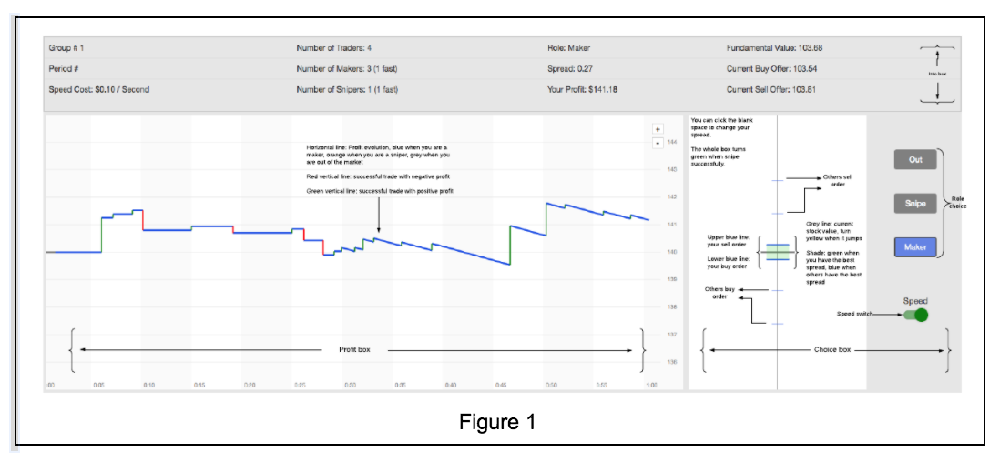

# Instructions

## General

Welcome to the LEEPS Laboratory. Please pay careful attention to the
instructions as real money is at stake. The session is expected to
last about one hour.  During the study, we will use Lab Dollars ($)
and at the end of the experiment all your earnings will be converted
to US Dollars (US $). You will receive one US Dollar for every XX Lab
Dollars ($) you earn during the experiment. All earnings will be paid
in cash, and participants do not risk losing money. You are guaranteed
a show up fee of 7 US Dollars.

## Environment and Definitions

This experiment resembles a financial market where you can make a profit from buying and selling shares of a stock.

**Trading Periods and Groups**

This session will consist of four trading periods, each lasting five minutes. There will be a one-minute break between trading periods. Each participant will be randomly grouped with seven other participants to form a market. That is, each market will have eight participants trading a single asset. At the beginning of a trading period, every participant will be randomly rematched into a new market.

**Trading Screen**

The interface for the experiment consists of a screen with three boxes and is displayed below. At the top, the info box displays basic information about the market and your current state. At the bottom left, the profit box shows a time diagram of your profit and successful transactions. At the bottom right, the choice box allows you to make decisions about your trading role and orders that you would like to send to the market. All of the boxes will be explained in detail below.

**Stock value**

The stock has a value (henceforth “V”) that is depicted by the long horizontal gray line in the center of the choice box (see Figure 1). For this experiment, V = $100.

**Buy Orders, Sell Orders, and Spreads**

All participants operate using buy orders and sell orders. If participant 1 submits a buy order for $99, this means she is willing to pay $99 or less to buy a share of the stock. Similarly, if participant 1 submits a sell order for $101, she is willing to receive $101 or more to sell a share of the stock. The price difference between a participant’s buy and sell orders is referred to as a spread for that individual. In the example above, the spread for participant 1 is $2. The price difference between the lowest sell order and the highest buy order (across all participants in the market) is called the market spread. 

**Jump events**

At random times, all buy and sell orders in the market will jump to new values. The size of the jump is identical for all orders, but of random magnitude and may be positive or negative. Every time there is a jump event, there will be a yellow flash around the center line for V. These jump events will occur, on average, every four seconds. 

**Investor arrivals**

At random times an automated investor arrives in the market trying to buy a share of the stock at the lowest possible selling price or to sell at the highest possible buying price. In today’s experiment, investors will arrive at an average rate of every three seconds. 

